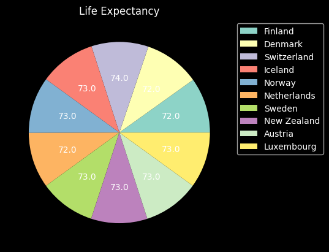
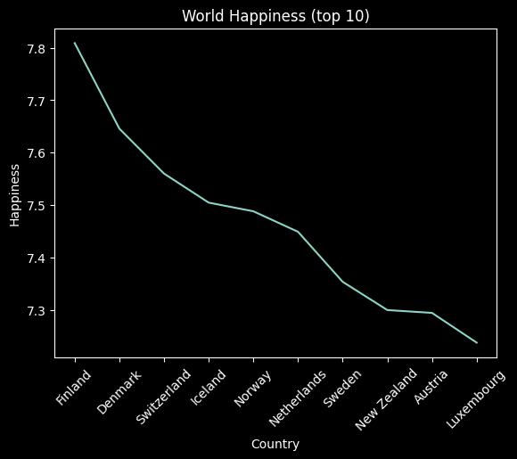
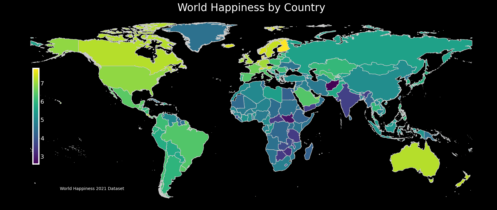
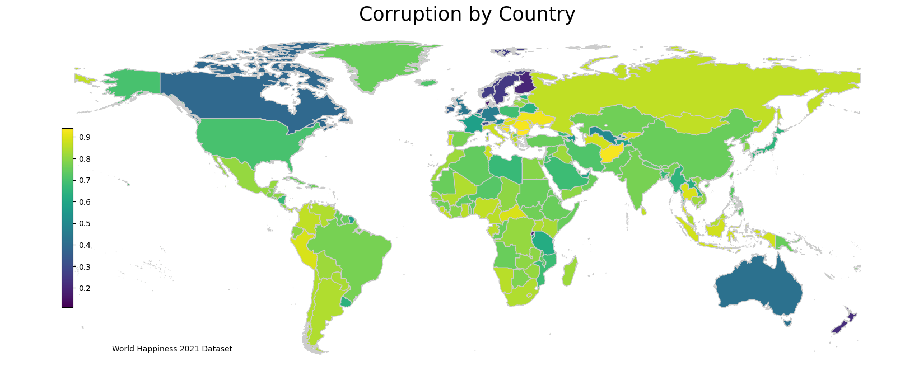

# Quality of Life Analysis

#### By: [Drew White](https://www.linkedin.com/in/drew-riley-white/)
<br>

This project is part of a larger project located here: [Team Week 1](https://github.com/Drewrwhite/team-week)

[Looker Dashboard](https://lookerstudio.google.com/reporting/52d48afb-bb2f-4cd3-b6ba-00984e39fbf5)

<br>

## Technologies Used

* Python
* Pandas
* GeoPandas
* Matplot
* Looker Studio
</br>

## Datasets Used


1. [World Happiness Report 2021](https://www.kaggle.com/datasets/ajaypalsinghlo/world-happiness-report-2021)
2. [World Happiness Ranking](https://www.kaggle.com/datasets/anamvillalpando/world-happiness-ranking)

</br>

## Description

This project analyzes global quality of life data found on Kaggle. The data was extracted, profiled, transformed and finally visualized.

<br>

A pie chart put together highlighting the life expectancy for the top 10 countries. Code for the visualization is located in `dw.ipynb`. Below is the pie chart:

<br>



A line graph highlighting the happiness score for the top 10 countries. Interesting note is there seems to be correlation between Happiness and Life Expectancy with the two showing the same exact top ten countries. Code for the visualization is located in `dw.ipynb`. Below is the line chart:

<br>



<br>

A map highlighting the happiness score for all countries as well as a map showing the corruption rate by country. Code for the visualization is located in `dw.ipynb`. Below is the output of the visualization:



<br>



<br>


### Setup/Installation Requirements
* Make new directory:
  ```bash
  mkdir <new-directory>
  cd <new-directory>
  ```
* Clone repository:
  ```bash
  git clone https://github.com/Drewrwhite/quality_of_life.git
  ```
* Set up a virtual environment in your terminal:
  ```bash
  python3.7 -m venv venv
  ```
* Activate the environment:
  ```bash
  source venv/bin/activate
  ```
* Install requirements.txt:
  ```bash
	pip install -r requirements.txt
  ```
* Open directory:
  ```bash
  code .
  ```
</br>

## Known Bugs

* No known bugs

<br>

## License

[MIT](./license.txt)

_If you find any issues, please reach out at: **d.white0002@gmail.com**._

Copyright (c) _2022_ _Drew White_

